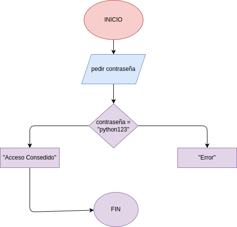

# Ejercicio No.1

Ejercicio No. 1: El validor de "Passwords" situación: Estás creando una app y quieres que el usuario no pueda avanzar hasta que introduzca la clave correcta. Problema: crea un programa que pida una contraseña. Si es correcta, debe decir "Error" y pedirla de nuevo. Si es "python123", debe decir "Acceso concedido"

## Diseño
